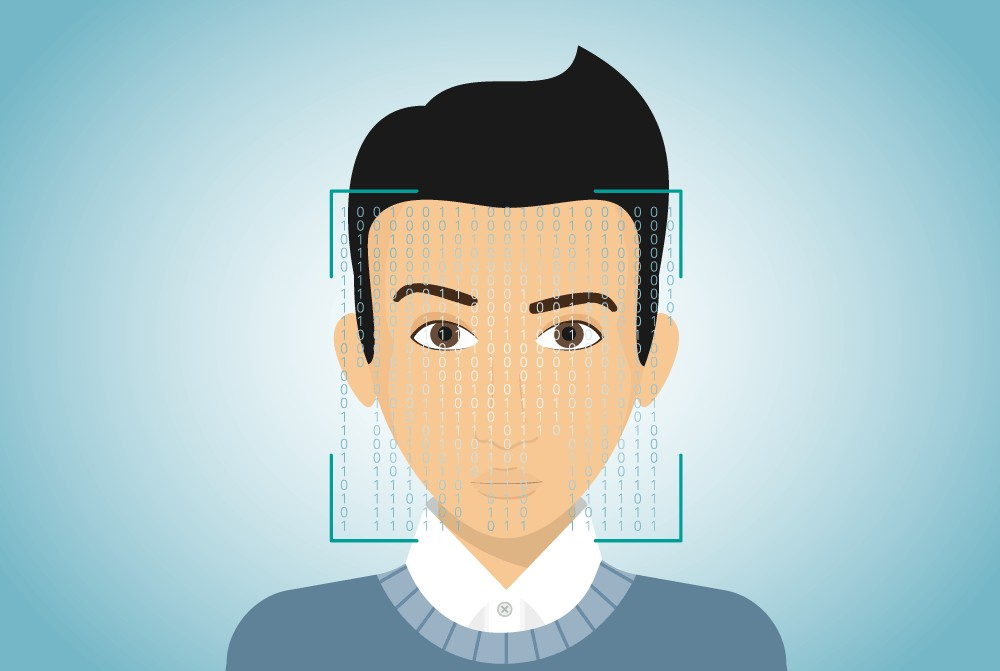
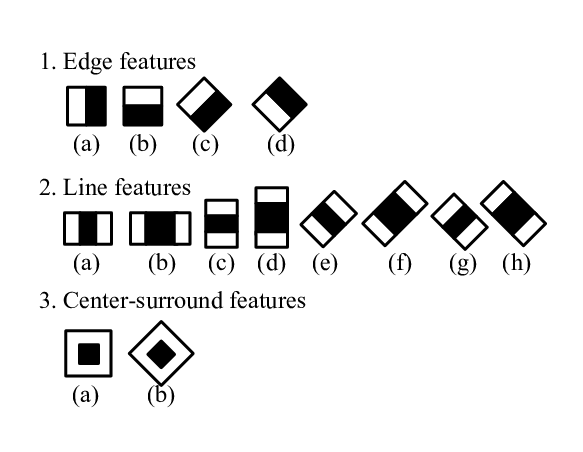
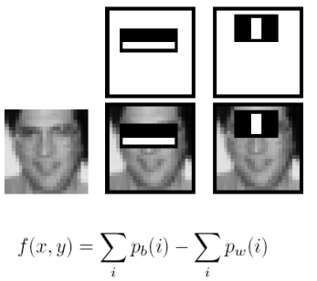
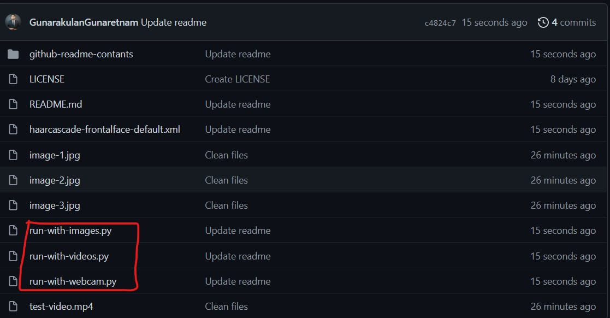
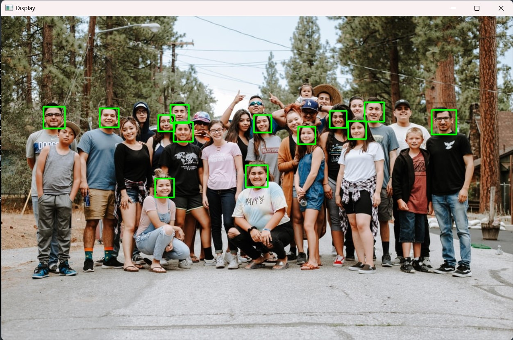
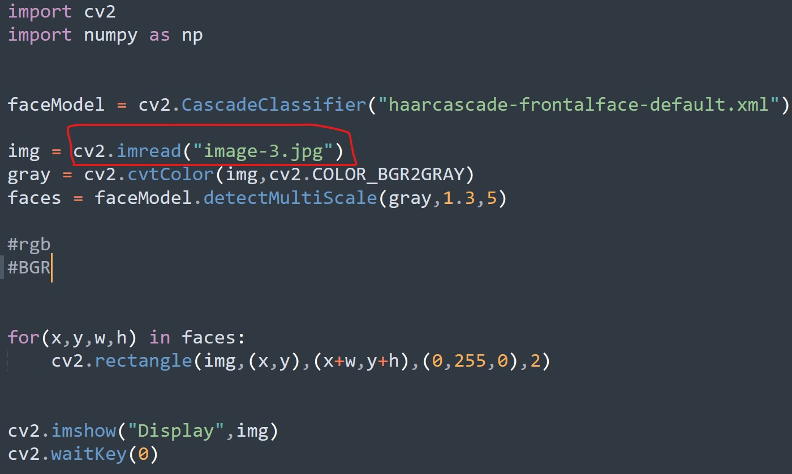
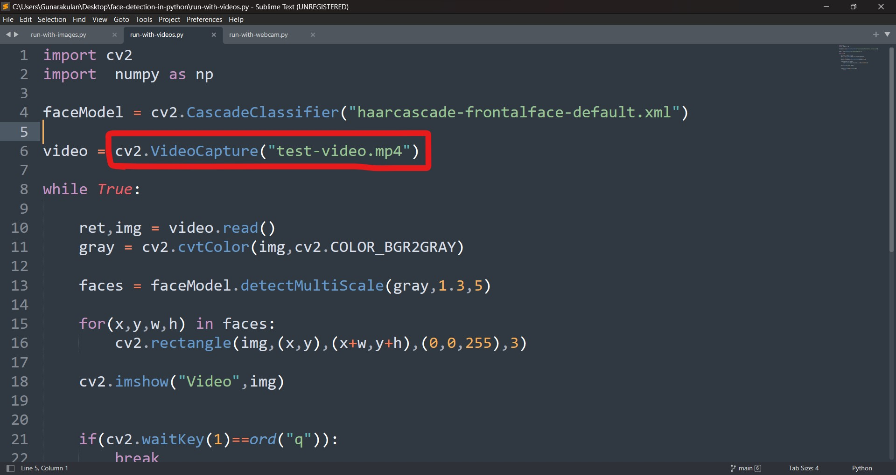
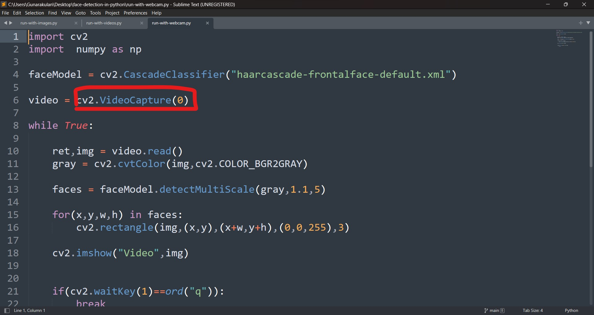

# Face Detection in Python

## Introduction

The definition of face detection refers to computer technology that is able to identify the presence of people’s faces within digital images. In order to work, face detection applications use machine learning and formulas known as algorithms to detecting human faces within larger images. These larger images might contain numerous objects that aren’t faces such as landscapes, buildings and other parts of humans (e.g. legs, shoulders and arms).

One of the most important applications of face detection, however, is facial recognition. Face recognition describes a biometric technology that goes way beyond recognizing when a human face is present. It actually attempts to establish whose face it is. The process works using a computer application that captures a digital image of an individual’s face (sometimes taken from a video frame) and compares it to images in a database of stored records. While facial recognition isn’t 100% accurate, it can very accurately determine when there is a strong chance that an person’s face matches someone in the database.

**Note:** This is a example of face detection not face recognition.




**Note:** This prototype is using Haar Cascade Classifier as a major component to perform face detection.


## Technology & Framework

- Python 3.8
- OpenCV

### Why OpenCV?

OpenCV is a library of programming functions mainly aimed at real-time computer vision. Originally developed by Intel, it was later supported by Willow Garage then Itseez. The library is cross-platform and free for use under the open-source Apache 2 License.

**Note:** OpenCV framework plays a major role in this prototype.


## Configuration & Setup

- Installing OpenCV

```
pip install opencv-python
```

## Haar Cascade Algorithm

 It is an Object Detection Algorithm used to identify faces in an image or a real time video. The algorithm uses edge or line detection features proposed by Viola and Jones in their research paper “Rapid Object Detection using a Boosted Cascade of Simple Features” published in 2001

 




**Researh Paper:** https://www.cs.cmu.edu/~efros/courses/LBMV07/Papers/viola-cvpr-01.pdf


## Project Structure

**Note:** There are 3 python scripts are in this project folders, those are the following.

- run-with-images.py - *To run with images*
- run-with-videos.py - *To run with video files*
- run-with-webcam.py - *To run with webcam*




## Run with Images (run-with-images.py)

- To execute this script

```
Python run-with-images.py

```

### Output



### To try with different images



**Note** To change different images, edit the image path in the cv2.imread() function.

## Run with videos (run-with-videos.py)

- To execute this script

```
Python run-with-videos.py

```

### Output


### To try with different webcam



**Note** To change different videos, edit the video path in the cv2.VideoCapture() function.

## Run with webcam (run-with-webcam.py)

- To execute this script

```
Python run-with-webcam.py

```

### Output


### To try with different webcam



**Note** To change different webcam, change the index in the cv2.VideoCapture() function. "0" means the first camera, "1" means the second camera and so on.

## Social Links

* [Linkedin Profile](https://www.linkedin.com/in/gunarakulangunaretnam)
* [Facebook Profile](https://www.facebook.com/gunarakulangr.page)
* [Instagram Profile](https://www.instagram.com/gunarakulangunaretnam)
* [Twitter Profile ](https://twitter.com/gunarakulangr)
* [Kaggle Profile](https://www.kaggle.com/gunarakulangr)
* [TikTok Profile](https://www.tiktok.com/@gunarakulangunaretnam)
* [Youtube Profile](https://www.youtube.com/channel/UCMWkED5sabgVZSCKjZuRJXA)
